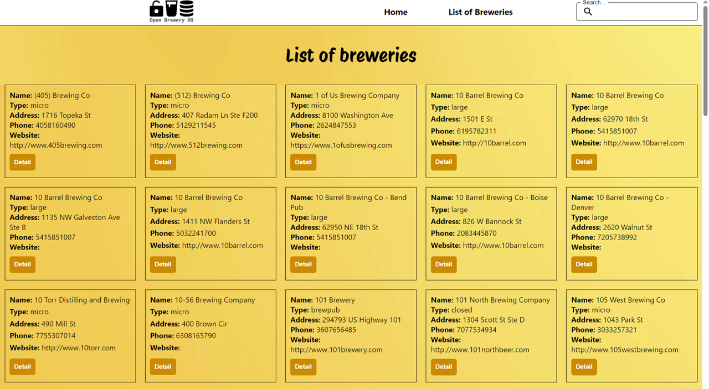

# Breweries App

The Breweries App is a web application built with TypeScript and React that allows users to browse a list of breweries fetched from the Open Brewery DB API.

## Features

- Browse a comprehensive list of breweries sourced from the Open Brewery DB API.
- View information about each brewery, such as name, type, city, state, and country.
- Click on a brewery to see detailed information on a separate page.
- User-friendly interface designed for smooth navigation and seamless browsing.

## Demo

- Check out the [Live Demo](https://fs-breweries-app.netlify.app/) to experience the Breweries App in action.

## Technologies Used

- TypeScript
- React
- CSS
- Material UI
